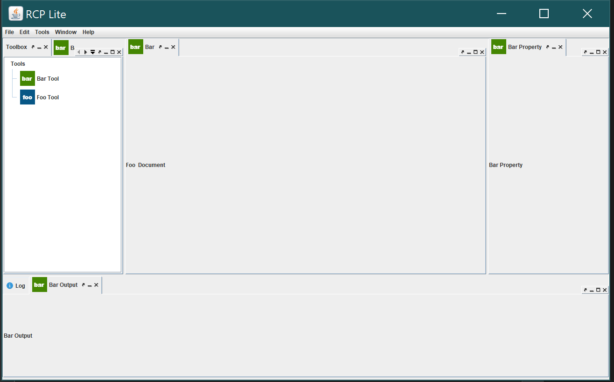
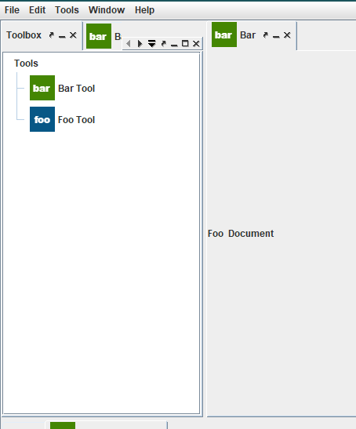
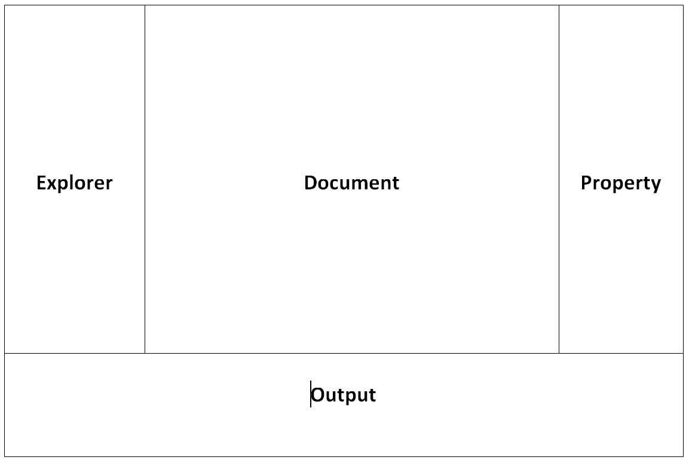

# RCP Lite
A minimalist Rich Client Platform inspired by Netbeans Platform




## Why RCP Lite
Since there is Eclipse RCP and Netbeans Platform for Java, why reinvent the wheel? The reason is simple, there are too huge for basic applications. If all you need is menus, a few docks here and there and your application is not an IDE why go through the long learning curve of Eclipse and Netbeans (they are not intended for IDEs alone) just for an application that requires a few lines of codes. 

## Usage
Add as dependencies
### Gradle
#### Add jitpack repository
    repositories {
        maven { url "https://jitpack.io" }
    }
    
#### Add the dependency    
    dependencies {
        compile 'com.github.yemikudaisi:RCP-Lite:master-SNAPSHOT'
        annotationProcessor 'com.github.yemikudaisi:RCP-Lite:master-SNAPSHOT'
    }
   
### Maven
#### Add jitpack repository
    <repositories>
		    <repository>
		        <id>jitpack.io</id>
		        <url>https://jitpack.io</url>
		    </repository>
    </repositories>
    
#### Add the dependency
    <dependency>
	      <groupId>com.github.yemikudaisi</groupId>
	      <artifactId>RCP-Lite</artifactId>
	      <version>master-SNAPSHOT</version>
	  </dependency>

Add this to the main method of your application
```java
public class Program{
    public static void main(String[] args) {
        PlatformShellConfiguration config = new PlatformShellConfiguration();
        config.setShowToolboxOnStartup(true)
                .setTitle("RCP Lite")
                .setMaximizeOnStartup(true);

        ShellService.getInstance().getShell()
                .setConfiguration(config);
        SwingUtilities.invokeLater(() -> ShellService.getInstance().getShell().launch());
    }
}
```

Now, when you run you application  you should see a pretty empty window.

## What it does

RCP lite allows you to build you application by composing concerns as separate tools. This provides a convenient way to separate code for various working parts of you application as tools.

For example, below is a very basic tool:

```java
package org.rcplite.sample.foo;

import org.rcplite.platform.modules.Tool;
import org.rcplite.platform.processing.ServiceProvider;
import org.rcplite.platform.utils.ImageManager;
import org.rcplite.platform.windows.Perspective;

import javax.swing.*;

@ServiceProvider(Tool.class)
public class FooTool implements Tool {
    @Override
    public String getTitle() {
        return "Foo Tool";
    }

    @Override
    public Icon getIcon() {
        return ImageManager.getImageIcon("/foo.png");
    }

    @Override
    public Perspective getPerspective() {
        return new Perspective();
    }
}
``` 

Asides inheriting the ``Tool`` class RCP Lite determines that the above class is a tool by use of annotations. In the above example notice the ``@ServiceProvider(Tool.class)`` annotation. It enables RCP Lite to add the Tool to its Tool Explorer and Menu in it's shell.



### Components
Components are displayed as tabs in the shell of the application depending on the position specified. To create a component simply inherit from ``ViewComponent`` class:
```java
public class FooDocumentComponent extends ViewComponent {	
	public FooDocumentComponent() {
	    setTitle("Foo Document");
	    setIcon(ImageManager.getImageIcon("/foo.png"));
        setLayout(new BorderLayout());
        add(new JLabel("Foo  Document"), BorderLayout.CENTER);
	}
}
```
#### Component positions
Components can be position in one of 4 places:
- Document (Center)
- Explorer (Left)
- Property (Right)
- Output (Bottom)



To diplay a Component as an explorer component, add the following annotation above the class
```java
@ViewComponent.Configuration(
        position = ComponentPosition.EXPLORER
)
```
other position can be configured as:
```java
position = ComponentPosition.DOCUMENT
position = ComponentPosition.PROPERTY
position = ComponentPosition.OUTPUT
```
#### Perspectives
The RCP Lite ``Perspective`` is the name given to an initial collection and arrangement of ``Components`` for a given ``Tool``. The shell can have multiple perspectives for each registered ``Tool`` but only one perspective is active at any point of time. The active perspective controls what components are displayed in the tabs in shell.

#### Event Aggregator
The RCP Lite event aggregator allows tools and components to publish and handle events using interfaces so that they don't have to know about each other existence and (most importantly) avoid dependencies across tools.

#### Logging
RCP Lite ships with a log panel position in the output area (Bottom) of the shell.....

TODO

## Todo
- Bug Fixes
- Complete documentation

## Warning
This framework should not be used in a production environment at this stage.

## License
[MIT License](https://opensource.org/licenses/MIT)
